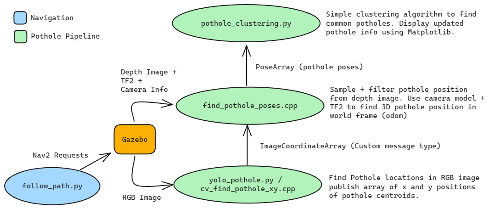

# CMP9767 Assessment Item 1 - Jacob Swindell (25105508)

This solution solves both the simple and realistic pothole maps using a modular mix of Python and C++ ROS2 nodes, each chosen when best suited. YOLOv8 was used for detecting realistic potholes while OpenCV was used to detect the simple potholes. Once potholes have been detected and published in 3D space a simple Euclidian distance clusterer is used to decide if the potholes are new or repeats. This clusterer uses matplotilb to display the progress of the solution. A simple Nav2 waypoint system is used to move the robot around the arena.



## How to start the system

### Realistic pothole map

You may have to install [ultralytics](https://pypi.org/project/ultralytics/) with `pip install ultralytics` before you run this task as it depends on YOLOv8 being installed. Recommended Nvidia GPU and Cuda Available.

Open 2 tabs, The first tab will be used to run the simulation, the second to run the solution. In the first tab run:

```bash
ros2 launch assignment_template sim_potholes.launch.py
```

Wait for the full navigation stack to initialise then run:

```bash
ros2 launch assignment_template potholes_solution.launch.py
```

### Simple pothole map

Open 2 tabs, The first tab will be used to run the simulation, the second to run the solution. In the first tab run:

```bash
ros2 launch assignment_template sim_potholes_simple.launch.py
```

Wait for the full navigation stack to initialise then run:

```bash
ros2 launch assignment_template potholes_simple_solution.launch.py
```